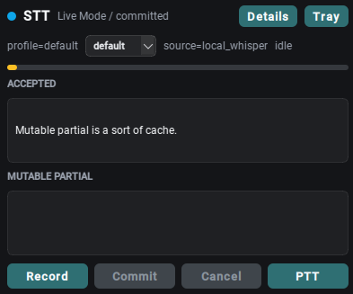
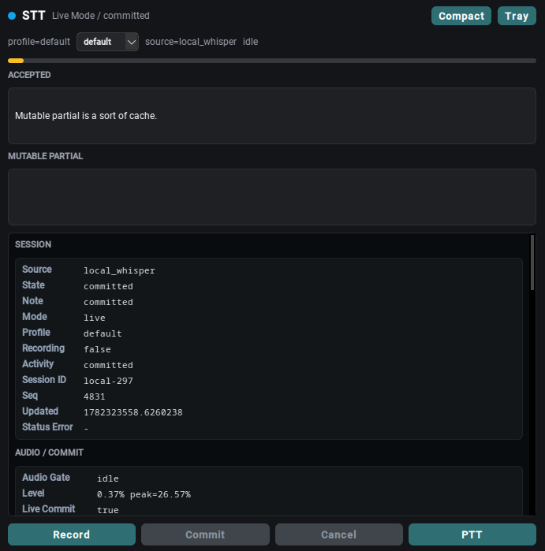

# Joe's Local STT Stack

Local faster-whisper dictation for X11/KDE. Runtime state stays under
`state/` and `logs/`; both are gitignored.

<table align="center">
  <tr valign="top">
    <td align="center">
      <br>
      <sub><b>Compact applet</b></sub>
    </td>
    <td align="center">
      <br>
      <sub><b>Details view</b></sub>
    </td>
  </tr>
</table>

The draggable, always-on-top HUD (and the system-tray icon) carry all dictation
status out-of-band, so nothing but dictated text ever lands in your focused
field. `Compact` is the small applet with the accepted/partial draft and
record/commit controls; `Details` expands into scrollable session and
audio/commit field tables.

## Use

```fish
cd ~/joes-local-stt-stack
fish scripts/stt.fish status
fish scripts/stt.fish start
```

Current mouse mapping:

- `Shift+Button9`: start recording with the currently selected profile
- `Shift+Button8`: commit

Current extra-key mapping:

- `XF86HomePage`: start recording with the currently selected profile
- `XF86Mail`: commit
- `XF86PowerOff` / `XF86PowerDown`: start debug recording

KDE power shortcuts are disabled for `PowerOff` and `PowerDown`, but the
physical power key can still bypass KDE through `systemd-logind` unless
`HandlePowerKey=ignore` is configured there.

This targets the dedicated browser-home/mail keys, not the normal navigation
`Home` key.

There is no mouse cancel binding. Use this if needed:

```fish
fish scripts/ptt_cancel.fish
```

## Status

The tray icon and floating HUD are the status surfaces. Nothing should be typed
into the focused field except dictated text.

- green/blue: idle in PTT/live mode
- orange recording: rejecting silence or too little signal
- red recording: accepting voice; includes a small level meter
- purple: finalizing
- green check: committed
- orange/gray: no voice or cancelled
- amber: error

The floating HUD shows accepted text, mutable partial text, the voice gate,
input level, and start/commit/cancel/live controls. It is draggable and stores
its position under `state/hud_position.json`. Use `Details` to expand it into a
scrollable diagnostic view with field tables for session/audio state and parsed
sections from `state/preview.txt`; use `Compact` to return to the small applet.
Use `Tray` to hide the floating HUD while leaving the system tray indicator
running.
The details view includes `Last Result`, which reports the last commit,
no-voice, divergence, injection failure, cancellation, or Android/external
outcome with reason, backend, final text, and injected text.

Sound cues are configured in `[sound.events]` in `config.toml`.
`voice_ready` plays once when a recording crosses from rejecting silence to
accepting voice.

## How it works

The stack is a set of decoupled user processes coordinated over a Unix socket:

- **Daemon (`dictate.py`)** — captures audio with `pw-record` (16 kHz mono),
  runs `faster-whisper` (`large-v3` on CUDA), reconciles rolling-window
  transcripts into stable text, injects it into the focused field, and serves a
  newline-delimited JSON control socket (`state/dictation.sock`).
- **Control CLI (`dictatectl.py`)** — `status`, `start`, `stop-commit`,
  `stop-cancel`, `toggle-live`, `switch-profile`, `inject-text`,
  `simulate-divergence`, `external-event`, and more.
- **Input listeners** — X11 mouse and extra-key services that just call the
  daemon over the socket.
- **Tray + HUD (`tray.py`)** — PyQt6 status surfaces.
- **Android bridge (`android_bridge.py`)** — optional WebSocket server that
  feeds phone speech-recognition events in as `external-event`s.

A few design points worth knowing:

- **Voice gate.** Capture is gated on sustained signal (roughly 8 chunks over
  1.0% RMS plus 3 over 2.0%) before any text is injected, so silence and stray
  triggers don't type anything. The gate level is shown live in the tray meter.
- **Live reconciliation.** As you speak, the daemon re-transcribes a rolling
  audio window; a *live strategy* turns those overlapping, self-revising
  transcripts into one monotonically growing stream. `rolling_append` (default)
  appends the stable common prefix; `mutable_tail` keeps the last couple of
  tokens as a backspace-and-replace draft. It only ever deletes text it injected
  this session, and on live/final divergence it replaces its own live text with
  the final transcript rather than leaving the field wrong.
- **Injection.** Backends are tried in order — `ydotool` (tuned with
  `--key-delay 4 --key-hold 4`) → `wtype` → `xdotool` → `stdout`.
- **Status is out-of-band.** All state lives in the tray icon, the HUD, and
  sound cues. Nothing but dictated text is ever typed into your field.

See [`profiles/`](profiles) for decode profiles and `config.toml` for the model,
audio, streaming, injection, and sound settings.

## Manage

```fish
fish scripts/stt.fish status
fish scripts/stt.fish restart
fish scripts/stt.fish restart --force  # cancels an active recording first
fish scripts/stt.fish logs 80
fish scripts/stt.fish logs --follow
fish scripts/stt.fish stop
fish scripts/stt.fish start
```

The stack runs as three separate user services:

- `personal-stt-daemon.service`: recorder, Whisper model, transcription, text injection
- `personal-stt-mouse-dictation.service`: X11 mouse-button listener
- `personal-stt-keyboard-dictation.service`: X11 extra-key listener
- `personal-stt-tray.service`: tray indicator

They are managed together through `scripts/stt.fish`.

## Tune

Primary config lives in `config.toml`. The active mouse binding uses the stable
profile:

- `profiles/default.toml`: stable route
- `profiles/mutable.toml`: experimental draft-replace route that types a
  mutable live draft into the focused field, then backspaces and replaces it
  as recognition changes. Use for short/medium tests in scratchable fields.

The paused experimental superfast profile remains in `profiles/superfast.toml`
and can be revisited later, but it is not currently bound to a mouse shortcut.
The stable profile uses rolling-append reconciliation.

Important current settings:

- `live_commit = true`
- `stable_rounds = 2`
- injection order: `ydotool`, `wtype`, `xdotool`, `stdout`
- `ydotool type` uses `--key-delay 4 --key-hold 4`
- voice gate: 8 chunks over `1.0%` RMS and 3 chunks over `2.0%` RMS

## Debug Live Streams

```fish
fish scripts/ptt_press_debug.fish
```

Debug sessions can still be started manually. They suppress live text insertion,
simulate what live mode would have accepted, and write branch diagnostics to the
single watch target, `state/preview.txt`. Commit still inserts the final full
transcription.
The HUD details panel also reads `state/preview.txt`, but it parses the
watch-board into readable sections rather than showing it as one raw text wall.
The output uses fixed line positions for `watch -n0.5`, with the latest rolling
transcripts, the current conflict branch, and simulated accept streams for
`stable_rounds=1/2/3`. The branch rows correspond to:

```text
prefix text (would_accept:<same> | stable:tail A | prev:tail B | current:tail C)
```

## Android Port Direction

The Android route treats phone STT partials as mutable drafts and sends them to
the desktop over WebSocket JSON. The desktop HUD displays partials immediately,
while final text is the commit/injection authority. See `ANDROID_PORT_PLAN.md`
and `android/README.md`.

```fish
fish scripts/stt.fish android-pin
fish scripts/stt.fish android-reverse
```

## Live Strategy Tests

Fast deterministic regression checks:

```fish
fish scripts/test_live_strategy.fish --synthetic-only
```

Offline audio probes run faster-whisper over rolling windows without injecting
text. CPU `tiny.en` is useful for checking append mechanics while the daemon
owns CUDA:

```fish
fish scripts/test_live_strategy.fish --model tiny.en --device cpu --compute-type int8
fish scripts/test_live_strategy.fish --audio /path/to/audio.wav --verbose
```

## Direct Commands

```bash
.venv/bin/python dictatectl.py --config config.toml status
.venv/bin/python dictatectl.py --config config.toml start
.venv/bin/python dictatectl.py --config config.toml stop-commit
fish scripts/smoke_test.fish
```

Python lookup in scripts prefers `PERSONAL_STT_VENV`, then repo-local `.venv`,
then `.venv-stt`, then `~/.venv`.
